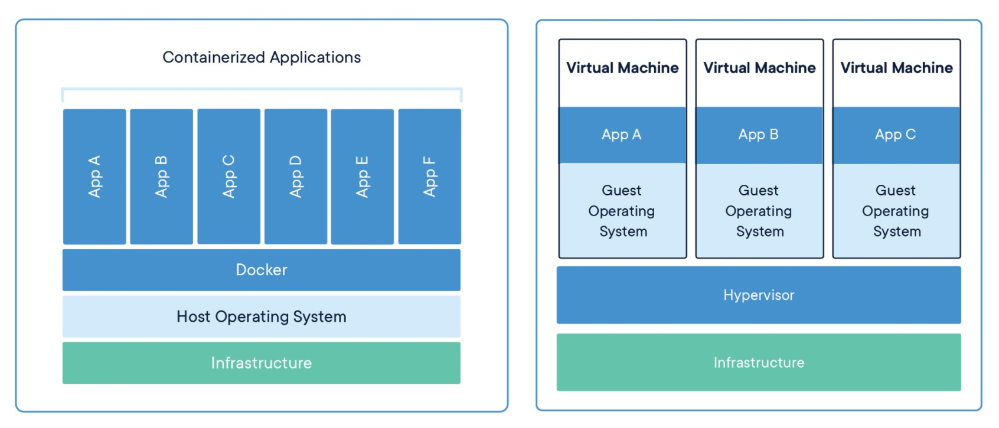

| Table of Contents                                              |
| -------------------------------------------------------------- |
| [What is Docker?](#What-is-Docker)                             |
| [Comparing Containers and Virtual Machines](#containers-vs-vm) |

If you are following the "cloud world", you have probably heard of [docker](https://docker.io). In this journal we will discuss what docker is and why we should use it.

You might have come across a situation where your code is working in your machine, but when you build and deploy to another machine or server it breaks. This is the main issue docker is trying to solve.

## 
What is Docker?

The idea of docker is to give a comprehensive abstraction layer to applications, so that developers can develop and run their applications without worrying about underlying infrastructure. Docker is an open source project to <u>pack, ship and run</u> any application as a lightweight container.

> Note: A container is a standard unit of software that packages up code and all its dependencies so the application runs quickly and reliably from one computing environment to another

So this is similar to virtual machines like VMware or VirtualBox? The answer is NO. There are a lot of differences. The main difference being docker provides an OS-level virtualization. It shares the OS, Linux kernel, across applications. On the other hand VMware(or other virtual machines) virtualizes hardware. We have to mount an OS to the virtual machine before running the applications. This leads to two issues, OS takes a lot of memory and storage spaces. It also utilizes more CPU which are valuable resources.

So next question is how docker is doing it? It is simple, docker uses a Linux kernel under the hood. You see, there are different Linux OS Debian, arch, Ubuntu, Mint, Red Hat etc. but all of them shares Linux Kernel. So what docker does is it assumes that we are building our app in a Linux machine, and it communicates to the Linux Kernel for different resources like storage, network etc.

Wait, Wait, Wait. I'm using Mac, are you saying that I can't use docker? No. For mac & Windows systems we can install [Docker for windows](https://docs.docker.com/desktop/windows/install/) or [Docker for Max](https://docs.docker.com/desktop/mac/install/), in which there is a mechanism to communicate with docker engine (will discuss this in later parts)

## 
Comparing Containers and Virtual Machines 

[source](https://www.docker.com/resources/what-container#/package_software)

| CONTAINERS                                                                                                                                                             | VIRTUAL MACHINES                                                                                                                                              |
| ---------------------------------------------------------------------------------------------------------------------------------------------------------------------- | ------------------------------------------------------------------------------------------------------------------------------------------------------------- |
| Abstraction at the app layer that packages code and dependencies together.                                                                                             | Virtual machines (VMs) are an abstraction of physical hardware turning one server into many servers.                                                          |
| Multiple containers can run on the same machine and share the OS kernel with other containers, each running as isolated processes in user space.                       | The hypervisor allows multiple VMs to run on a single machine.                                                                                                |
| Containers take up less space than VMs (container images are typically tens of MBs in size), can handle more applications and require fewer VMs and Operating systems. | Each VM includes a full copy of an operating system, the application, necessary binaries and libraries - taking up tens of GBs. VMs can also be slow to boot. |

So from this, it is obvious that docker saves a lot of time and effort of developers and ops team. In next part We will discuss how docker works under the hood. We will also create a sample docker container application which has an inter container communication.

Thanks
